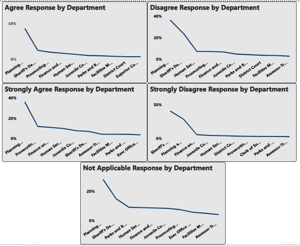

# Employee Survey Response
---

---

## Introduction
This is a Power BI Project of an Employee Survey Responses which are actual responses from an employee engagement survey conducted by Pierce County WA and completed voluntarily by government employees. The dataset is a Single table and contains 14,725 records. The total number of fields is 10.

## Problem Statement
1.  Which survey questions did respondents agree with or disagree with most?
2.  Do you see any patterns or trends by department or role?
3.   As an employer, what steps might you take to improve employee satisfaction based on the survey results?
- NB: Generate your own insights to add to this.

## Data Cleaning
Empty spaces were replaced with 0 and those with wrong data type were changed.

## Visualization
The report comprises of 2 dashboards and there is a small table. You will see there are 5 (five) types of feedback/response; 
-  0 — Not Applicable
-  1 — Strongly Disagree
-  2 — Disagree
-  3 — Agree 
-  4 — Strongly Agree

## Analysis
- Survey Questions

From the feedback, most of the empolyees strongly agreed on the survey question "I know what is expected of me at work" and strongly disagree on the survey question "In the last seven days, I have received recognition or praise for doing good work"

- Trends in the department role
  

I noticed there is a trend in Planning and Public Work department, this department has the highest response except for strongly disagree response,though they are the top 2

- Steps to take
1.  As an employee, I will focus on the disagree and strongly disagree response of the survey results then I will try to work on them

From the response, you will notice that most employee does not have a best friend and they have never been praised after a good work, which means the work environment is not eco-friendly and there is no encouragement.

2.  As an employee,I will try and make the work enviroment eco-friendly and employee who do their best will be praised and be given a bonus.
   
3.  I will try to make an employee's report at the end of the each months, where employees will be rated according to their performance so that those with low rating will be accountable for their performance and will learn to grow and perform better.

4.  I will make rooms for seminars and workshop for learning and growth of every employees and the company.

- Insights

From my insights, I calculated for Director,Manager,Supervisor and Staff. I noticed the strongly agreee response text from director, manager and supervisor has higher percentage in that they already know what they're getting into compared to other staffs that just only agree.

## Recommendation
- I will recommend a continous survey questions so that the employee will know what's going on in the company
- I will also recommend an employee's  report at the end of the month so that there won't be ba bias due to positions
- I will also recommend seminars and workshop for learning and growth of every employees and the company.

